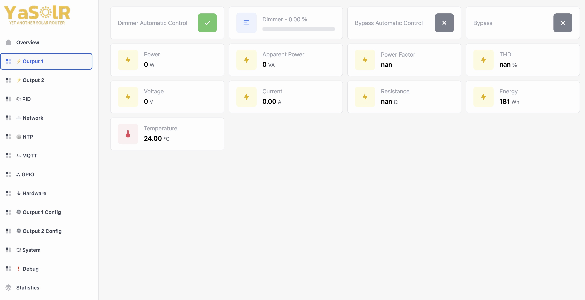
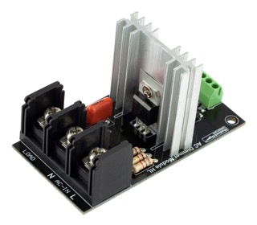
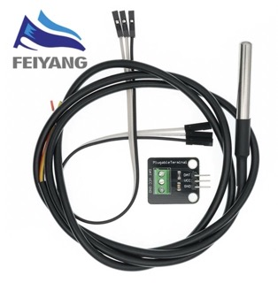

# YaSolR ?

YaSolR is an ESP32 firmware for **Solar Router** compatible with nearly **any existing hardware components**.
It supports most hardware used in routers like:

- [F1ATB](https://f1atb.fr/fr/realisation-dun-routeur-photovoltaique-multi-sources-multi-modes-et-modulaire/)
- [Routeur solaire "Le Profes'Solaire"](https://sites.google.com/view/le-professolaire/routeur-professolaire)
- etc

If you already have a Solar Router at home based on ESP32, built by yourself or someone else, there is a good chance that YaSolR will be compatible.

|  |  |

YaSolR **is a software** that will run on your Solar Router.

YaSolR **does not come with hardware**.
But this website will help you pick and build your router.

Please go to the [overview](overview) page to know how a solar router works.

## Benefits

YaSolR is one of the **most optimized and powerful** Open-Source Solar Router firmware available:

- **Reactivity and speed of measurements**: YaSolR is able to make a measurement every 42 ms, and **adjusts the routing at least 3 times per second.**
- **PID**: YaSolR is the only router to use a **PID algorithm proportional to the measurements** to adjust the routing, which allows to control the corrections with more precision and avoids overshoots that cause oscillations, over-consumptions or over-excess.
- **PID Tuning**: YaSolR offers a PID tuning screen to adjust the PID parameters in real time, without recompiling the code.
- **Frequency**: YaSolR is able to autodetect and operate on a frequency of **50 Hz and 60 Hz**, but also on a frequency of 51 Hz (for example on an Enedis generator).
- **Resolution**: YaSolR has a routing resolution of **12 bits** with linear interpolation, so is able to be precise to the nearest watt with a load of more than 4000W. Routers with such precision are rare. Most routers have a precision of 100 steps, or 30W for a load of 3000W.
- **Zero-Cross Pulse Analysis**: YaSolR analyzes the pulses of the Zero-Cross circuit to detect the positions of the rising and falling edges, which allows to synchronize the triggering of the TRIAC as precisely as possible during the true zero crossing. Most ZC-based routers calculate a false trigger value from the rising edge of the pulse, which happens to be before the zero crossing.
- **Hardware**: YaSolR is the only router that does not impose hardware and offers **wide compatibility**.
- Supports the concept of **virtual grid power** which allows compatibility with a **second router or an EV charging station**
- Phase control features: **dimmer remapping** (like Shelly Dimmer), **power limit**, etc.
- **Bypass** (forced operation) according to schedule and / or temperature
- **Simplicity**: YaSolR is one of the rare routers to **directly support the LSA voltage regulator** via a DAC, without the requirement of an external voltage
- **Configurable**: YaSolR allows you to reconfigure your **GPIO** to be compatible with existing setups of the solar prof and F1ATB among others.
- **3-Phase** support with JSY-333, Shelly or MQTT
- **Harmonics** can be lowered to comply with regulations thanks to several settings
- **Independent or Sequential Outputs** with grid excess sharing
- **SSL/TLS MQTT Support** with embedded root certificates
- **Specialized libraries for dimmers, ZCD and measurements** optimized and written specifically for YaSolR ESP32

This is a big **Open-Source** project following **best development practices**.
YaSolR is:

- **flexible** by allowing you to pick the hardware you want
- **easy to use** with one of the **best easy-to-use and responsive Web Interface**, **REST** API and **MQTT** API
- compatible with **Home Assistant** and other home automation systems (Auto Discovery)
- compatible with **EV Charging Box** like OpenEVSE
- supports **remote** temperature and measurement
- compatible with **many hardware components**:
  - DS18 Temperature Sensors
  - ESP32: Dev Kit boards, S3 Dev Kit boards, ESP32s, WIPI 3, Denky D4, Lilygo T Eth Lite S3 boards (**Ethernet support**), WT32-ETH01 boards (**Ethernet support**), Olimex ESP32-POE boards (**Ethernet support**), Olimex ESP32 Gateway boards (**Ethernet support**)
  - Many Zero-Cross Detection modules (JSY-MK-194G, Pulse ZCD, BM1Z102FJ, etc)
  - Random (async) and Zero-Cross (sync) Solid State Relays
  - RobotDyn 24A / 40A
  - Voltage Regulators (Loncont LSA or LCTC)
  - Many measurement tools (PZEM-004T v3, JSY-MK-333, JSY-MK-193, JSY-MK-194T, JSY-MK-194G, JSY-MK-163T, JSY-MK-227, JSY-MK-229, JSY Remote by UDP, MQTT)

## Detailed Features

- [Outputs](#outputs)
  - [Dimmer (required)](#dimmer-required)
  - [Bypass Relay (optional)](#bypass-relay-optional)
  - [Temperature (optional)](#temperature-optional)
  - [Measurement device (optional)](#measurement-device-optional)
  - [Additional Output Features](#additional-output-features)
- [Grid Power Measurement](#grid-power-measurement)
- [Relays](#relays)
- [Monitoring and Management](#monitoring-and-management)
- [MQTT, REST API and Home Automation Systems](#mqtt-rest-api-and-home-automation-systems)
- [Online / Offline modes](#online--offline-modes)
- [PID Control and Tuning](#pid-control-and-tuning)
- [Virtual Excess and EV Charger Compatibility](#virtual-excess-and-ev-charger-compatibility)

### Outputs

YaSolR supports up to 2 outputs.
A routing output is connected to a resistive load and controls its power by dimming the voltage.
Each output is composed of the following components:

- [Dimmer (required)](#dimmer-required)
- [Bypass Relay (optional)](#bypass-relay-optional)
- [Temperature (optional)](#temperature-optional)
- [Measurement device (optional)](#measurement-device-optional)
- [Additional Output Features](#additional-output-features)

#### Dimmer (required)

A dimmer controls the power sent to the load.
Example of supported dimmers:

|                           | **RobotDyn 24A**   | **RobotDyn 40A**   | **Random SSR**   | **Zero-Cross SSR**   | **Voltage Regulator**   |
| :------------------------ | :-------------------------------------------------------------: | :-------------------------------------------------------------: | :-----------------------------------------------------------: | :---------------------------------------------------------------: | :-------------------------------------------------------------------: |
| `Phase Control`           |                               ✅                                |                               ✅                                |                              ✅                               |                                ❌                                 |                                  ✅                                   |
| `Burst Fire Control` (🚧) |                               ✅                                |                               ✅                                |                              ✅                               |                                ✅                                 |                                  ✅                                   |

All the supported dimmer types:

- Zero-Cross Detection based:
  - LSA / LCTC Voltage Regulators + PWM->Analog 0-10V + ZCD
  - Random Solid State Relay + ZCD
  - RobotDyn 24/40A
  - Triac + ZCD
- PWM based:
  - LSA / LCTC Voltage Regulators + PWM->Analog
- DAC based:
  - LSA / LCTC Voltage Regulators + DAC GP8211S (DFR1071)
  - LSA / LCTC Voltage Regulators + DAC GP8403 (DFR0971)
  - LSA / LCTC Voltage Regulators + DAC GP8413 (DFR1073)

#### Bypass Relay (optional)

A bypass relay allows to force a heating at full power and bypass the dimmer at a given schedule or manually.
Keeping a dimmer `on` generates heat so a bypass relay can be installed to avoid using the dimmer.

**If a bypass relay is installed, the dimmer will be used instead and will be set to 0-100% to simulate the relay.**

Here are the supported bypass relays:

|                      Electromagnetic Relay                       |                      Zero-Cross SSR                      |                      Random SSR                      |
| :--------------------------------------------------------------: | :------------------------------------------------------: | :--------------------------------------------------: |
|  |  |  |

Note that the electromagnetic relay above is interesting because it has both a NO and NC contacts.
So the NC contact (closed when relay is in default open position) can be connected to the dimmer and used to prevent any power to go through the dimmer when the bypass relay is on.

#### Temperature (optional)

Measuring the temperature of the water tanker is important to be able to trigger automatic heating based on temperature thresholds, or stop the routing if the temperature i reached.

This can also be done:

- using a remote temperature sensor through MQTT
- using a remote temperature sensor through ESP-Now (🚧)
- using one of the supported sensor:

|                    DS18B20                     |
| :--------------------------------------------: |
|  |

#### Measurement device (optional)

Each output supports an optional measurement device to measure the power routed to the load.
Here is a list of all supported devices:

- `JSY-MK-193` **first channel** (AC, RS485 interface)
- `JSY-MK-194T` and `JSY-MK-194G` **first channel** (AC, TTL interface)
- `PZEM-004T V3`
- Remote JSY through **UDP** with [MycilaJSY UDP Sender](https://github.com/mathieucarbou/MycilaJSY?tab=readme-ov-file#remote-jsy) (as fast as a local JSY!)
- Remote JSY through **ESP-Now** (🚧) (as fast as a local JSY!)

|                     PZEM-004T V3                      |                           JSY                            |
| :---------------------------------------------------: | :------------------------------------------------------: |
|  |  |

#### Additional Output Features

- `Bypass Automatic Control` / `Manual Control`: Automatically force a heating as needed based on days, hours, temperature range, or control it manually
- `Dimmer Automatic Control` / `Manual Control`: Automatically send the grid excess to the resistive load through the dimmer (or manually control the dimmer yourself if disabled)
- `Excess Power Limiter (W)` for Independent or Sequential Outputs: Outputs are sequential by default (second output activated after first one at 100%).
  **Independent outputs are also supported** thanks to the sharing feature to split the excess between outputs.
- `Dimmer Duty Limiter`: Set a limit to the dimmer power to avoid routing too much power
- `Dimmer Temperature Limiter`: Set a limit to the dimmer to stop it when a temperature is reached. This temperature can be different than the temperature used in auto bypass mode.
- `Statistics`: Harmonic information, power factor, energy, routed power, etc
- `Automatic Resistance Detection`: if a JSY or PZEM is installed, automatically discover and save the resistance value of the connected load.
- `Dimmer Range Remapping`: Remap the dimmer duty to a different range (e.g. 10-80%).
  Some dimmers (especially voltage regulator controlled through a PWM-analog conversion), are working between 1-8V so remapping the duty is necessary.
- `Zero-Cross Pulse Analysis`: YaSolR will analyze ZC pulses from the Zero-Cross Detection and display the average pulse length and period

### Grid Power Measurement

Measuring the grid power is essential to know how much power is available to route.
YaSolR supports many ways to measure the grid power and voltage:

**Mono-phase**:

- `MQTT` (**Home Assistant**, **Jeedom**, `Shelly EM`, etc)
- `JSY-MK-163T` (AC, TTL interface)
- `JSY-MK-193` **second channel** (AC, RS485 interface)
- `JSY-MK-194T` and `JSY-MK-194G` **second channel** (AC, TTL interface)
- `JSY-MK-227` and `JSY-MK-229` (AC and DC, RS485 interface)
- Remote JSY through **UDP** with [MycilaJSY UDP Sender](https://github.com/mathieucarbou/MycilaJSY?tab=readme-ov-file#remote-jsy) (as fast as a local JSY!)
- Remote JSY through **ESP-Now** (🚧) (as fast as a local JSY!)

**3-Phase**:

- `MQTT` (**Home Assistant**, **Jeedom**, `Shelly 3EM`, etc)
- `JSY-MK-333` and `JSY-MK-333G` (AC, RS485 interface)
- Remote JSY through **UDP** with [MycilaJSY UDP Sender](https://github.com/mathieucarbou/MycilaJSY?tab=readme-ov-file#remote-jsy) (as fast as a local JSY!)
- Remote JSY through **ESP-Now** (🚧) (as fast as a local JSY!)

### Relays

YaSolR supports up to 2 relays to control external resistive loads or contactors.

- Supports `NO / NC` relay type
- `Automatic Control` / `Manual Control`: You can specify the resistive load power in watts connected to the relay.
  If you do so, the relay will be automatically activated based on the excess power.

### Monitoring and Management

- `Charts`: Live charts (grid power, routed power, THDi, PID tuning, etc)
- `Display`: Support I2C OLED Display (`SSD1307`, `SH1106`, `SH1107`)
- `GPIO`: A GPIO section shows the view of configured pins and activated pins, to report issues, duplications or invalid pins.
- `Health`: configuration mistakes are detected as much as possible and issues displayed when a component was found to not properly work.
- `Translation`: en / fr
- `LEDs`: Support LEDs for visual alerts
- `Push Button`: Support a push button to restart the device
- `Restart`, `Factory Reset`, `Config Backup & Restore`, `Debug Mode`, etc
- `Statistics`: Harmonic information, power factor, energy, routed power, grid power, grid frequency and voltage, etc
- `system Temperature Sensor`: Support a temperature sensor for the router box (`DS18B20`)
- `Web console`: View ESP logs live from a Web interface
- `Web OTA Firmware Update`: Update firmware through a Web interface (with SafeBoot recovery partition)

### MQTT, REST API and Home Automation Systems

The router exposes a lot of statistics and information through MQTT and REST API and provides a very good integration with Home Assistant or other home automation systems.
The router can be completely controlled remotely through a Home Automation System.

- `REST API`: extensive REST API support
- `MQTT`: extensive MQTT API (with `TLS` support)
- [Home Assistant Integration](https://www.home-assistant.io/integrations/mqtt/#mqtt-discovery): Activate Home Assistant Auto Discovery to automatically create a YaSolR device in Home Assistant with all the sensors

### Online / Offline modes

- `Access Point Mode`: router can **work in AP mode without WiFi and Internet**
- `Admin Password`: to protect the website, API and Access Point
- `Captive Portal` a captive portal is started first time to help you connect the router
- `Ethernet & Wifi`: **ESP32 boards with Ethernet and WiFi are supported**
- `NTP` support to synchronize time and date with Internet. If not activated, it is still possible to manually sync with your browser.
- `Offline Mode`: **The router can work without WiFi, even the features requiring time and date.**

### PID Control and Tuning

The router uses a PID controller to control the dimmers and you have full control over the PID parameters to tune it.

Demo on Youtube:

")

### Virtual Excess and EV Charger Compatibility

Thanks to power measurement, the router also provides these features:

- `Virtual Excess`: Expose the virtual excess (MQTT, REST API, web) which is composed of the current excess plus the routing power
- `EV Charger Compatibility` (i.e OpenEVSE): Don't prevent an EV charge to start (router can have lower priority than an EV box to consume available production excess)

**A measurement device is required to use these features.**
